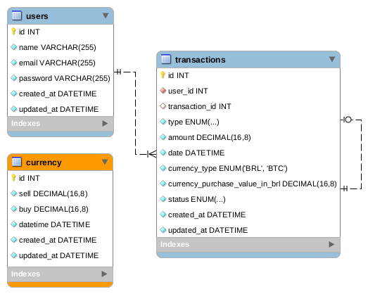

# Eduzz Backend Challenge

Contato: gabrieldnrodrigues@gmail.com

## :scroll: Sumário

1. [O Projeto](##Projeto)
2. [Demonstração online](https://aws.eduzz.dissotti.com:3333)
3. [Artefatos](##Artefatos)
4. [Desafios](##Desafios)
5. [Possíveis-Melhorias](##Possíveis-Melhorias)
6. [Tecnologias e Métodos Utilizados](##Tecnologias-e-Métodos-Utilizados)
7. [Detalhes da Execução das Tarefas](##Detalhes-da-Execução-das-Tarefas)
8. [Como Rodar](##Como-Rodar)
9. [Requisitos de Ambiente](##Requisitos-de-Ambiente)
10. [Setup da Aplicação](##Setup-da-Aplicação)
11. [Comandos Úteis para Desenvolvedores](##Comandos-Úteis-para-Desenvolvedores)
12. [Rodar em produção](##Rodar-em-produção)
13. [Considerações Finais](##Considerações-Finais)

## ✨ Projeto

O Projeto é uma API de investimento em bitcoins, possuí registro de usuários, login, realização de depósitos, consulta de saldo, cotação, compra e venda de bitcoins, posição dos investimentos, extrato bancário e histórico de cotação das últimas 24 horas e volume de compras e vendas do dia. [mais informações](./docs/Challenge.md)

- Tempo levado para finalizar: 31h 39m [detalhes](##Detalhes-da-Execução-das-Tarefas)

### [Demonstração online](https://aws.eduzz.dissotti.com:3333)

### Artefatos
- A documentação da API pode ser visualizada no seu próprio link: [aws.eduzz.dissotti.com:3333](https://aws.eduzz.dissotti.com:3333)

- [Cobertura dos Testes](https://aws.eduzz.dissotti.com:3333/coverage)

- Diagrama Entidade Relacionamento:



### Desafios
- Criar a modelagem e um algoritimo otimizados que contemple a compra e venda de bitcoins foi a parte mais desafiadora.
- Utilizar typescript em uma API completa em Node.js, eu já havia utilizado antes mas apenas para uma API de middleware simples, mas nessa precisei utilizar models, jobs e migrations e com certeza isso me agregou muito conhecimento.

### Possíveis Melhorias

Algumas possíveis melhorias à ser implementadas são:
- Adicionar cacheamento com Redis no endpoint de posições de investimento, ao liquidar ou criar um novo investimento o cache seria apagado e atualizado na próxima requisição, isso também poderia ser feito no endpoint de histórico de cotação do bitcoin.
- Adicionar transações do sequelize para que se houver erros durante uma compra, o sistema reverter quaisquer alterações em banco feitas durante requisição.

### Tecnologias e Métodos Utilizados

- Node.js
- Express
- REST
- TypeScript
- Docker
- MariaDB
- ESlint / Prettier
- Sequelize ORM
  - Migrations
- Swagger
- TDD com Jest
  - testes de integração
  - testes de unidade
  - Rodando testes no SQlite
- Código totalmente em inglês
- Cache e Filas
- Modelagem pensada com escalabilidade
- API preparada para ser utilizada com HTTPS
- Variáveis de Ambiente
- Middlewares
- Handlebars
- Padronização de commits: [Commitzen](https://github.com/commitizen)
- Workflow: [GitFlow](https://danielkummer.github.io/git-flow-cheatsheet/index.pt_BR.html)
- Segurança:
  - CORS
  - Hash de senhas
  - Autenticação por JWT
  - Validação de requisições
- Performance/Desempenho
  - Redis (utilizado com Bee Queue para processos em segundo plano com filas)
  - Paginação de resultados de consulta

## Detalhes da Execução das Tarefas

- Análise e Modelagem do Projeto - 3h 15
- Criar migrations e models - 1h 40
- Estruturar Projeto - 1h 53m
- Configurar envio de emails e enviar email ao criar depósito - 1h 16m
- Criar endpoint para exibir histórico do bitcoin - 2h 12m
- Criar endpoint para exibir o volume de compras e vendas BTC no dia - 1h 11m
- Criar endpoint para exibir extrato - 53m
- Aprimorar método de liquidação - 1h 39m
- Criar endpoint para venda de bitcoin - 5h 18m
- Criar API para exibir posições de investimentos - 2h 31m
- Criar endpoint para obter saldo do usuário logado - 2h 9m
- Enviar email para o usuário ao finalizar compra - 20m
- Criar API para comprar bitcoins - 2h 10m
- Criar API para obter cotação do bitcoin - 51m
- Criar endpoint de depósito - 52m
- Criar endpoints de cadastro de login com JWT - 42m
- Aprimorar Projeto - 2h 48m

## Como Rodar

### Requisitos de Ambiente
- Docker version 19.03.3, build a872fc2f86
- docker-compose version 1.24.1, build 4667896b
- Node.js v12.16.1
- Yarn 1.22.0
- Linux (Testado em Ubuntu 19.10)

### Setup da Aplicação
Na raiz da aplicação:

- Inicialize os serviços em Docker:
```sh
sudo docker-compose up -d
```
- Configure as variáveis de ambiente:
```sh
cp .env.development .env # já vem configurada para docker
```
- Execute as migrations para subir o banco de dados:
```sh
yarn sequelize db:migrate
```
- Inicialize o servidor
```sh
yarn start
```

- Em outro terminal, inicialize o servidor de processos em background (Queues)
```sh
yarn queue
```

## Comandos Úteis para Desenvolvedores

```sh
# create seeds:
yarn sequelize seed:generate --name seed-name

# run seeds
yarn sequelize db:seed:all

# undo seeds
yarn sequelize db:seed:undo:all

# create migration:
yarn sequelize migration:create --name=migration-name

# undo migrations
yarn sequelize db:migrate:undo:all
```

## Rodar em produção

- Utilize o [pm2](https://pm2.keymetrics.io/) para subir as aplicações
- Você pode utilizar https adicionado a env SSL_DIR com o local onde estão os arquivos de certificado, verifique no server.js se o nome dos arquivos são corretos. Você pode utilizar o [letsencrypt](https://www.linode.com/docs/security/ssl/install-lets-encrypt-to-create-ssl-certificates/) junto com o apache2 (o apache2 apenas para gerar certificados gratuítos, mas não é usado como servidor).
- Utilize um servidor MariaDB 10.5.1 nativo
- Utilize um servidor Redis 4.0.9-3 nativo

## Considerações Finais

Eu agradeceria muito por sugestões de melhorias, obrigado pela atenção!

Contato: gabrieldnrodrigues@gmail.com
